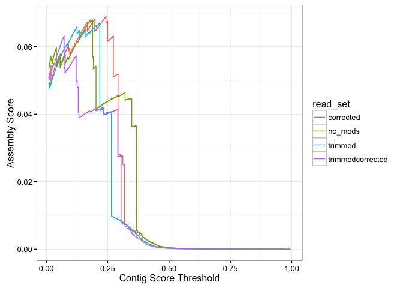
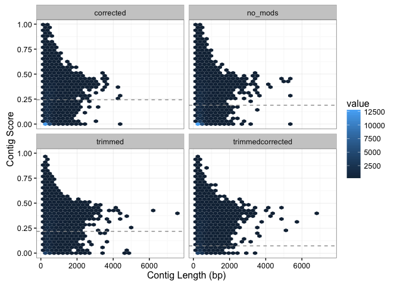
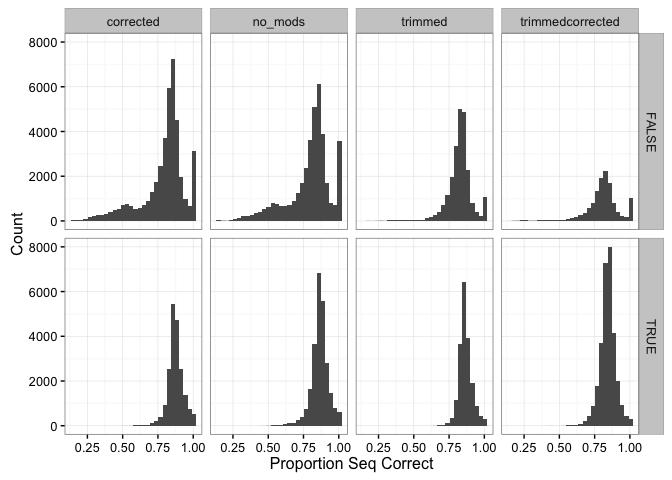
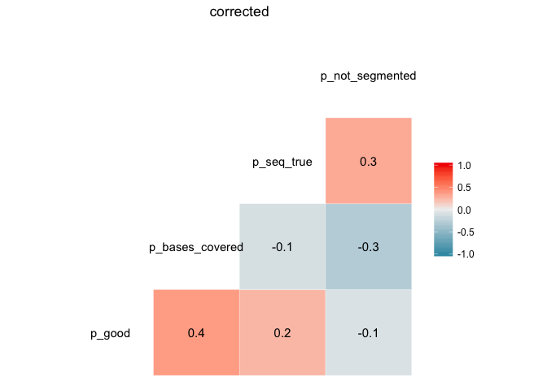
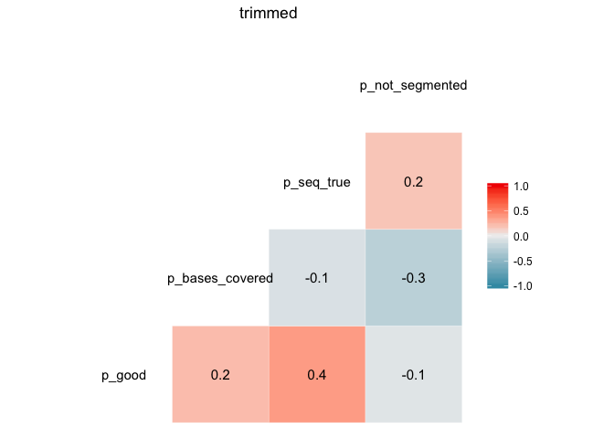
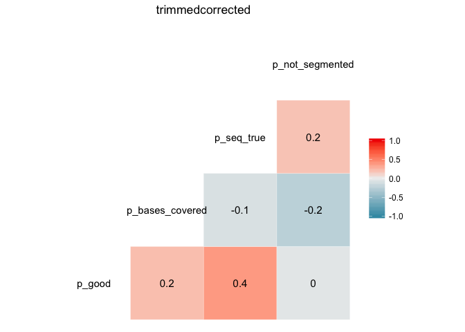
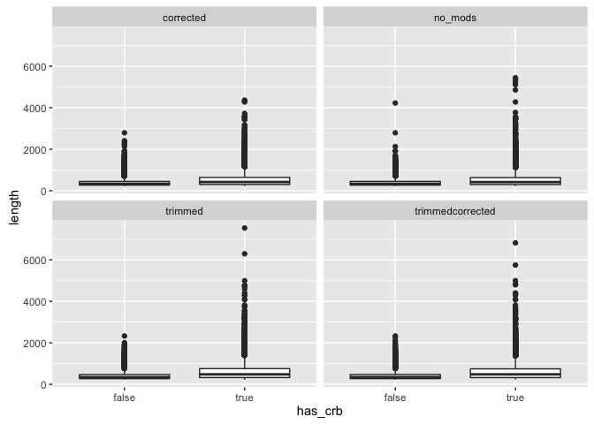

# Trinity and Transrate Tutorial
Nate Olson  
May 2, 2016  


## Background 
* Transcriptome
* Transcriptome assembly
      * Trinity [@haas2013novo]
* Transcriptome assembly evaluation
      * Reference based
      * Read based
      * Transrate - contig level quality score [@smith2015transrate]
* C. elegans transcriptome assembly and evaluation (what we did)

## Assembly
### Source data  
* Dataset description  
* Genbank accessions  

### How to run trinity  
* Link to website  
* Parameter description
* Command used to generate _C. elegans_ assembly

### Assembly results  
Assembly metrics calculated using Transrate, see http://hibberdlab.com/transrate/metrics.html for a description of the different metrics.  

__TODO__  
* Better summary of assembly metrics  

```r
assembly_metrics_df <- list(no_mods = "data/no_mods/", 
                            corrected = "data/corrected/",
                            trimmed = "data/trimmed/", 
                            trimmedcorrected = "data/trimmedcorrected/") %>% 
      map(paste0, "assemblies.csv") %>%  
      map_df(read_csv, .id = "read_set") %>% 
      select(-assembly) %>% 
      gather("metric","value", -read_set) 
```

__TODO__ Need to workout `read_set` order

```r
assembly_metrics_df %>% 
      filter(metric %in% c("n_seqs", "smallest", "largest", 
                           "n50", "n_with_orf")) %>%
      spread(metric, value) %>% 
      select(read_set, n_seqs, smallest, n50, largest, n_with_orf) %>% 
      kable(digits = 2,
            caption = "Trinity _C. elegans_ transcriptome assembly summary metrics.")
```


Table: Trinity _C. elegans_ transcriptome assembly summary metrics.

read_set            n_seqs   smallest   n50   largest   n_with_orf
-----------------  -------  ---------  ----  --------  -----------
corrected            61059        224   467      4364        12075
no_mods              63353        224   465      5446        12426
trimmed              42438        224   531      7533        10552
trimmedcorrected     42851        224   532      6816        10645

## Assembly evaluation
### Running transrate
* Installation
      * Precompiled binaries available from website (http://hibberdlab.com/transrate/), along with instructions to build from source
      * also command to install dependencies `transrate --install-deps type` where type can be either `all`, `read`, or `ref`.
      * See Transrate website for additional information for install. 


__Command Line__  
```
transrate \
  --left=SRR2969230_1.fastq \
  --right=SRR2969230_2.fastq \
  --assembly=Trinity_sequences.Trinity.fixed.fasta \
  --output=transrate/
```

* Parameters 

```
Transrate v1.0.2
by Richard Smith-Unna, Chris Boursnell, Rob Patro,
   Julian Hibberd, and Steve Kelly

DESCRIPTION:
Analyse a de-novo transcriptome assembly using three kinds of metrics:

1. sequence based (if --assembly is given)
2. read mapping based (if --left and --right are given)
3. reference based (if --reference is given)

Documentation at http://hibberdlab.com/transrate

USAGE:
transrate <options>

OPTIONS:
  --assembly=<s>            Assembly file(s) in FASTA format, comma-separated
  --left=<s>                Left reads file(s) in FASTQ format, comma-separated
  --right=<s>               Right reads file(s) in FASTQ format, comma-separated
  --reference=<s>           Reference proteome or transcriptome file in FASTA format
  --threads=<i>             Number of threads to use (default: 8)
  --merge-assemblies=<s>    Merge best contigs from multiple assemblies into file
  --output=<s>              Directory where results are output (will be created) (default: transrate_results)
  --loglevel=<s>            Log level. One of [error, info, warn, debug] (default: info)
  --install-deps=<s>        Install any missing dependencies. One of [ref]
  --examples                Show some example commands with explanations
```

### Transrate results
The unmodified read set was passed as input to Transrate, 
potentally biasing some metric results towards the unmodifed assembly.

#### run time
- real    890m58.016s
- user    6665m50.869s
- sys     11m5.890s

#### Assembly Scores
Read trimming and error correction resulted in the highest weighted assembly score, 
while having the lowest contig score cutoff, 
but a lower optimal score.  


```r
assembly_metrics_df %>% 
      filter(metric %in% c("score", "optimal_score", "cutoff", "weighted")) %>%
      spread(metric, value) %>% 
      kable(digits = 2,
            caption = "Trinity _C. elegans_ transcriptome Transrate score summary.")
```


Table: Trinity _C. elegans_ transcriptome Transrate score summary.

read_set            cutoff   optimal_score   score   weighted
-----------------  -------  --------------  ------  ---------
corrected             0.24            0.07    0.02       0.65
no_mods               0.19            0.07    0.02       0.54
trimmed               0.22            0.07    0.03       0.67
trimmedcorrected      0.07            0.06    0.03       0.78


#### Contig level read mapping stats

```r
# bam_stat <- read_csv("data/Trinity_sequences.Trinity.fixed/Trinity_sequences.Trinity.fixed.fasta_bam_info.csv")
```

#### Assembly Score Optimization

```r
assembly_score_opt <- results_list %>% map(paste0,"assembly_score_optimisation.csv") %>% 
      map_df(read_csv, .id = "read_set")
```

Relationship between the cutoff for contig score and assembly score.

```r
assembly_score_opt %>% 
      ggplot() + geom_path(aes(x = cutoff, y = assembly_score, color = read_set)) +
            theme_bw() +
            labs(x = "Contig Score Threshold", y = "Assembly Score")
```

```
## Warning: Removed 2 rows containing missing values (geom_path).
```



### Contigs

```r
contig_stat <- results_list %>% map(paste0,"contigs.csv") %>% 
      map_df(read_csv, .id = "read_set")

contig_cutoff <- assembly_metrics_df %>% filter(metric == "cutoff") %>% 
      select(-metric) %>% rename(cutoff = value)
contig_stat <- contig_stat %>% left_join(contig_cutoff) %>% 
      mutate(contig_filt = cutoff < score)
```

```
## Joining by: "read_set"
```


__Contig Score Distribution__
Trimming reads resulted in a higher proportion of contigs with scores greater than 0.25 then assemblies using unmodified reads or only error corrected reads.  


```r
contig_stat %>% 
      ggplot() + geom_density(aes(x = score, color = read_set, fill = read_set), 
                              alpha = 0.25) + theme_bw()
```


Relationship between contig score and length. 

```r
contig_stat %>% 
      ggplot() + geom_hex(aes(x = length, y = score)) +
            geom_hline(aes(yintercept = cutoff), 
                       color = "grey60", linetype = 2) +
            theme_bw() +
            labs(x = "Contig Length (bp)", y = "Contig Score") +
            facet_wrap(~read_set)
```

<div class="figure">

<p class="caption">2D histogram of contig score and legnth, with color indicating abundance. Grey dotted lines are the contig score cutoff for optimal assembly score.</p>
</div>

Proportion of bases in reads map to the transcript that agree with the transcript contig. 


```r
contig_stat %>% 
      ggplot() + geom_histogram(aes(x = p_good)) +
            theme_bw() +
            labs(x = "Proportion of Bases Aggree with Transcript",
                 y = "Count") +
            facet_grid(contig_filt~read_set) +
            theme(legend.position = "bottom")
```

```
## `stat_bin()` using `bins = 30`. Pick better value with `binwidth`.
```

<div class="figure">

<p class="caption">Histogram of the proportion of bases in agreement with contig and contig length.</p>
</div>

Proportion of bases coverage by mapped reads.

```r
contig_stat %>% 
      ggplot() + geom_histogram(aes(x = p_bases_covered)) +
            theme_bw() +
            labs(x = "Proportion of Covered Bases", 
                 y = "Count") +
            facet_grid(contig_filt~read_set) +
            theme(legend.position = "bottom")
```

```
## `stat_bin()` using `bins = 30`. Pick better value with `binwidth`.
```




```r
contig_stat %>% 
      ggplot() + geom_histogram(aes(x = p_seq_true)) +
            theme_bw() +
            labs(x = "Proportion Seq Correct", 
                 y = "Count") +
            facet_grid(contig_filt~read_set) +
            theme(legend.position = "bottom")
```

```
## `stat_bin()` using `bins = 30`. Pick better value with `binwidth`.
```


```r
contig_stat %>% 
      ggplot() + geom_histogram(aes(x = p_not_segmented)) +
            theme_bw() +
            labs(x = "Proportion of Non-Segmented Contigs", 
                 y = "Count") +
            facet_grid(contig_filt~read_set) +
            theme(legend.position = "bottom")
```

```
## `stat_bin()` using `bins = 30`. Pick better value with `binwidth`.
```


The individual parameters used to calculate the contig score are weakly correlated. 
Correlation values are similar to thoes presented in the Transrate publication. 


```r
for(i in names(results_list)){
      pl <- contig_stat %>% filter(read_set == i) %>% 
            select(p_good, p_bases_covered, p_seq_true, p_not_segmented) %>% 
            ggcorr(method = c("pairwise","spearman"),label = TRUE) + 
                  ggtitle(i)
      print(pl)
}
```




```r
minmap <- read_tsv("../analysis/celegans/minimap_trinity_cds.pfa",
                   col_names = c("ref_id","ref_tran_len","ref_start","ref_end",
                                 "break","t_id","t_contig_len","t_start","t_end",
                                 "ref_aln_len", "t_aln_len","aln_score","aln_met"))
```

Total transcripts in reference with hits 102766

Number of contigs mapping to each contig

```r
count_sum <- minmap %>% group_by(ref_id, t_id) %>% summarize(aln_count = n()) 
count_sum %>% filter(aln_count < 10) %>% 
      ggplot() + geom_density(aes(x = aln_count))
```



Contigs map to most contigs more than once with a number of contigs having more than 10 and with over 300 aligning to one reference transcript.


c_elegans_ref_genome/Caenorhabditis_elegans.WBcel235.31.pep.all.fa

```r
count_sum %>% filter(aln_count > 10) %>% .$ref_id %>% unique() %>% length()
```

```
## [1] 2422
```

Looking at the contig with 300

```r
#count_sum 
```


```r
contig_stat_map <- minmap %>% mutate(contig_name = str_replace(t_id, "|","_")) %>% left_join(contig_stat)
```

```
## Joining by: "contig_name"
```

```r
contig_stat_map <- contig_stat_map %>% mutate(aln_ratio = ref_aln_len/t_aln_len)
```


```r
# ggplot(contig_stat_map) + geom_point(aes(x = aln_ratio, y = score))
```

__TODO__
* Other factors of interest
* Expore seq information for example high scoring and low scoring contigs

### Transrate-paper method results
* Github repository for paper 
* ability to rerun analysis - reproducible research
* https://github.com/blahah/transrate-paper

## Conclusions
* How did Trinity do?
* How did transrate compare to other methods?
* Recommendations for transcriptome assembly and evaluation

## Session Information
__Session Info__

```r
s_info <- devtools::session_info()
print(s_info$platform)
```

```
##  setting  value                       
##  version  R version 3.2.4 (2016-03-10)
##  system   x86_64, darwin13.4.0        
##  ui       X11                         
##  language (EN)                        
##  collate  en_US.UTF-8                 
##  tz       America/New_York            
##  date     2016-05-08
```

```r
kable(s_info$packages)
```


package      *    version      date         source                          
-----------  ---  -----------  -----------  --------------------------------
assertthat        0.1          2013-12-06   CRAN (R 3.2.0)                  
colorspace        1.2-6        2015-03-11   CRAN (R 3.2.0)                  
DBI               0.3.1        2014-09-24   CRAN (R 3.2.0)                  
devtools          1.11.1       2016-04-21   CRAN (R 3.2.5)                  
digest            0.6.9        2016-01-08   CRAN (R 3.2.3)                  
dplyr        *    0.4.3.9000   2016-02-11   Github (hadley/dplyr@9bae2aa)   
evaluate          0.8.3        2016-03-05   CRAN (R 3.2.4)                  
formatR           1.3          2016-03-05   CRAN (R 3.2.4)                  
GGally       *    1.0.1        2016-01-14   CRAN (R 3.2.3)                  
ggplot2      *    2.1.0        2016-03-01   CRAN (R 3.2.4)                  
gtable            0.2.0        2016-02-26   CRAN (R 3.2.3)                  
hexbin       *    1.27.1       2015-08-19   CRAN (R 3.2.0)                  
highr             0.5.1        2015-09-18   CRAN (R 3.2.1)                  
htmltools         0.3.5        2016-03-21   CRAN (R 3.2.4)                  
knitr        *    1.12.3       2016-01-22   CRAN (R 3.2.3)                  
labeling          0.3          2014-08-23   CRAN (R 3.2.0)                  
lattice           0.20-33      2015-07-14   CRAN (R 3.2.4)                  
lazyeval          0.1.10       2015-01-02   CRAN (R 3.2.0)                  
magrittr          1.5          2014-11-22   CRAN (R 3.2.0)                  
memoise           1.0.0        2016-01-29   CRAN (R 3.2.3)                  
munsell           0.4.3        2016-02-13   CRAN (R 3.2.3)                  
plyr              1.8.3        2015-06-12   CRAN (R 3.2.0)                  
purrr        *    0.2.1        2016-02-13   CRAN (R 3.2.3)                  
R6                2.1.2        2016-01-26   CRAN (R 3.2.3)                  
Rcpp              0.12.4       2016-03-26   CRAN (R 3.2.4)                  
readr        *    0.2.2        2015-10-22   CRAN (R 3.2.0)                  
reshape           0.8.5        2014-04-23   CRAN (R 3.2.0)                  
reshape2          1.4.1        2014-12-06   CRAN (R 3.2.0)                  
rmarkdown         0.9.5        2016-02-22   CRAN (R 3.2.3)                  
scales            0.4.0        2016-02-26   CRAN (R 3.2.3)                  
stringi           1.0-1        2015-10-22   CRAN (R 3.2.1)                  
stringr      *    1.0.0.9000   2015-11-23   Github (hadley/stringr@a67f8f0) 
tidyr        *    0.4.1        2016-02-05   CRAN (R 3.2.3)                  
withr             1.0.1        2016-02-04   CRAN (R 3.2.3)                  
yaml              2.1.13       2014-06-12   CRAN (R 3.2.0)                  
## References
