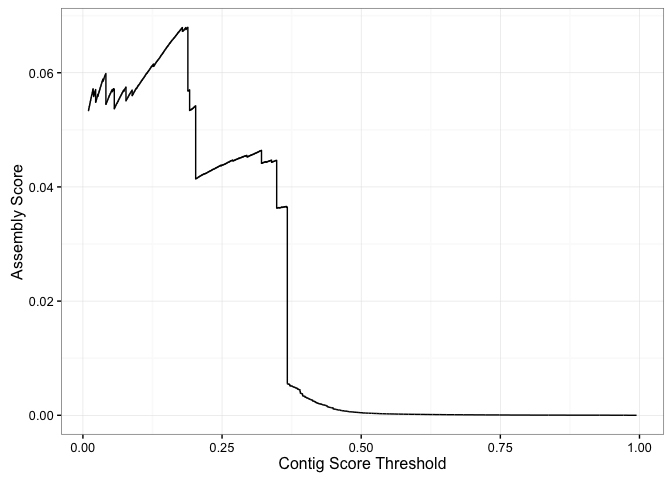
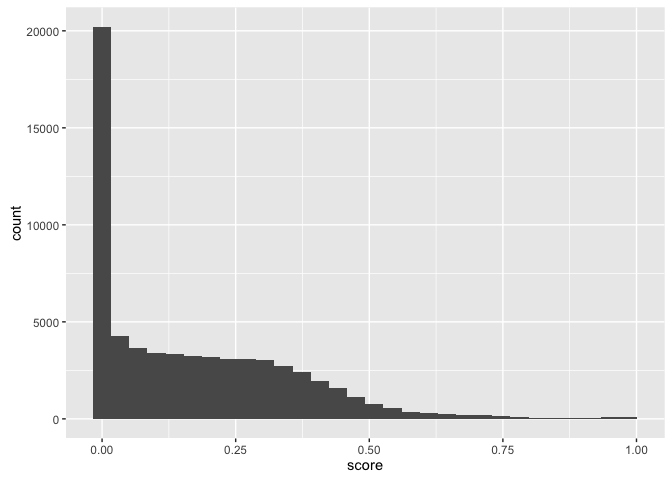
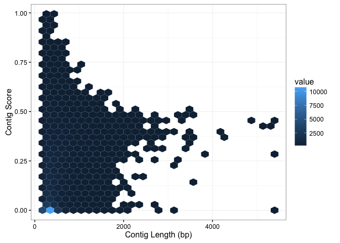

# Trinity and Transrate Tutorial
Nate Olson  
May 2, 2016  

```r
library(knitr)
library(readr)
library(dplyr)
```

```
## 
## Attaching package: 'dplyr'
```

```
## The following objects are masked from 'package:stats':
## 
##     filter, lag
```

```
## The following objects are masked from 'package:base':
## 
##     intersect, setdiff, setequal, union
```

```r
library(tidyr)
library(stringr)
library(ggplot2)
```


## Background 
* Transcriptome
* Transcriptome assembly
      * Trinity
* Transcriptome assembly evaluation
      * Reference based
      * Read based
      * Transrate - contig level quality score
* C. elegans transcriptome assembly and evaluation (what we did)

## Assembly
### Source data  
* Dataset description  
* Genbank accessions  

### How to run trinity  
* Link to website  
* Parameter description
* Command used to generate _C. elegans_ assembly

### Assembly results  
Assembly metrics calculated using Transrate, see http://hibberdlab.com/transrate/metrics.html for a description of the different metrics.  

__TODO__  
* Better summary of assembly metrics  

```r
read_csv("data/assemblies.csv") %>% 
      select(-assembly) %>% gather("metric","value") %>% 
      kable(digits = 2,caption = "Trinity _C. elegans_ transcriptome assembly summary metrics.")
```


Table: Trinity _C. elegans_ transcriptome assembly summary metrics.

metric                         value
----------------------  ------------
n_seqs                      63353.00
smallest                      224.00
largest                      5446.00
n_bases                  27876618.00
mean_len                      440.02
n_under_200                     0.00
n_over_1k                    2347.00
n_over_10k                      0.00
n_with_orf                  12426.00
mean_orf_percent               76.40
n90                           261.00
n70                           349.00
n50                           465.00
n30                           641.00
n10                          1050.00
gc                              0.42
gc_skew                         0.01
at_skew                         0.00
cpg_ratio                       1.97
bases_n                         0.00
proportion_n                    0.00
linguistic_complexity           0.09
fragments                35763023.00
fragments_mapped         25107946.00
p_fragments_mapped              0.70
good_mappings            10918012.00
p_good_mapping                  0.31
bad_mappings             14189934.00
potential_bridges           29681.00
bases_uncovered           3961029.00
p_bases_uncovered               0.14
contigs_uncovbase           44026.00
p_contigs_uncovbase             0.69
contigs_uncovered            8835.00
p_contigs_uncovered             0.14
contigs_lowcovered          40648.00
p_contigs_lowcovered            0.64
contigs_segmented           12294.00
p_contigs_segmented             0.19
score                           0.02
optimal_score                   0.07
cutoff                          0.19
weighted                        0.54


## Assembly evaluation
### Running transrate
* Installation
      * Precompiled binaries available from website (http://hibberdlab.com/transrate/), along with instructions to build from source
      * also command to install dependencies `transrate --install-deps type` where type can be either `all`, `read`, or `ref`.
      * See Transrate website for additional information for install. 

* Commandline

```
transrate \
  --left=SRR2969230_1.fastq \
  --right=SRR2969230_2.fastq \
  --assembly=Trinity_sequences.Trinity.fixed.fasta \
  --output=transrate/
```

* Parameters 

```
Transrate v1.0.2
by Richard Smith-Unna, Chris Boursnell, Rob Patro,
   Julian Hibberd, and Steve Kelly

DESCRIPTION:
Analyse a de-novo transcriptome assembly using three kinds of metrics:

1. sequence based (if --assembly is given)
2. read mapping based (if --left and --right are given)
3. reference based (if --reference is given)

Documentation at http://hibberdlab.com/transrate

USAGE:
transrate <options>

OPTIONS:
  --assembly=<s>            Assembly file(s) in FASTA format, comma-separated
  --left=<s>                Left reads file(s) in FASTQ format, comma-separated
  --right=<s>               Right reads file(s) in FASTQ format, comma-separated
  --reference=<s>           Reference proteome or transcriptome file in FASTA format
  --threads=<i>             Number of threads to use (default: 8)
  --merge-assemblies=<s>    Merge best contigs from multiple assemblies into file
  --output=<s>              Directory where results are output (will be created) (default: transrate_results)
  --loglevel=<s>            Log level. One of [error, info, warn, debug] (default: info)
  --install-deps=<s>        Install any missing dependencies. One of [ref]
  --examples                Show some example commands with explanations
```

### Transrate results
#### run time
- real    890m58.016s
- user    6665m50.869s
- sys     11m5.890s

* Description of output files
      * assemblies.csv - assembly summary metrics (Table X)


#### Contig level read mapping stats

```r
bam_stat <- read_csv("data/Trinity_sequences.Trinity.fixed/Trinity_sequences.Trinity.fixed.fasta_bam_info.csv")
bam_stat
```

```
## Source: local data frame [63,353 x 10]
## 
##            name p_seq_true bridges length fragments_mapped both_mapped
##           (chr)      (dbl)   (int)  (int)            (int)       (int)
## 1  TR1_c0_g1_i1   0.856907       2    760               59          58
## 2  TR2_c0_g1_i1   0.898214       0    228                8           8
## 3  TR3_c0_g1_i1   0.850286       0    403               12          11
## 4  TR4_c0_g1_i1   0.876786       0    282                9           8
## 5  TR5_c0_g1_i1   0.429740       1    235               14           5
## 6  TR6_c0_g1_i1   0.754286       0    294                6           6
## 7  TR7_c0_g1_i1   0.980952       3    230                3           3
## 8  TR7_c0_g2_i1   0.821429       1    230                2           2
## 9  TR8_c0_g1_i1   0.902041       0    313               14          14
## 10 TR9_c0_g1_i1   0.957143       1    278                5           4
## ..          ...        ...     ...    ...              ...         ...
## Variables not shown: properpair (int), good (int), bases_uncovered (int),
##   p_not_segmented (dbl).
```

#### Assembly Score Optimization

```r
assembly_score_opt <- read_csv("data/Trinity_sequences.Trinity.fixed/assembly_score_optimisation.csv") 
```

Relationship between the cutoff for contig score and assembly score.

```r
assembly_score_opt %>% 
      ggplot() + geom_path(aes(x = cutoff, assembly_score)) +
            theme_bw() +
            labs(x = "Contig Score Threshold", y = "Assembly Score")
```

```
## Warning: Removed 1 rows containing missing values (geom_path).
```



Contigs

```r
contig_stat <- read_csv("data/Trinity_sequences.Trinity.fixed/contigs.csv")
contig_stat
```

```
## Source: local data frame [63,353 x 19]
## 
##     contig_name length  prop_gc   gc_skew   at_skew cpg_count cpg_ratio
##           (chr)  (int)    (dbl)     (dbl)     (dbl)     (int)     (dbl)
## 1  TR1_c0_g1_i1    760 0.403947 -0.003257  0.077263        68  2.193362
## 2  TR2_c0_g1_i1    228 0.486842 -0.153153 -0.247863        37  2.804521
## 3  TR3_c0_g1_i1    403 0.411911  0.060241  0.037975        27  1.585227
## 4  TR4_c0_g1_i1    282 0.340426 -0.041667  0.086022        15  1.839130
## 5  TR5_c0_g1_i1    235 0.404255  0.010526 -0.071429        20  2.083333
## 6  TR6_c0_g1_i1    294 0.445578  0.053435  0.276074        37  2.542777
## 7  TR7_c0_g1_i1    230 0.395652 -0.384615 -0.251799        14  1.825397
## 8  TR7_c0_g2_i1    230 0.400000 -0.282609 -0.217391        14  1.653826
## 9  TR8_c0_g1_i1    313 0.399361 -0.024000 -0.063830        26  2.084529
## 10 TR9_c0_g1_i1    278 0.453237  0.333333  0.197368        20  1.575964
## ..          ...    ...      ...       ...       ...       ...       ...
## Variables not shown: orf_length (int), linguistic_complexity_6 (dbl),
##   in_bridges (int), p_good (dbl), p_bases_covered (dbl), p_seq_true (dbl),
##   score (dbl), p_not_segmented (dbl), eff_length (int), eff_count (dbl),
##   tpm (dbl), coverage (dbl).
```

Contig Score Distribution

```r
contig_stat %>% 
      ggplot() + geom_histogram(aes(x = score))
```

```
## `stat_bin()` using `bins = 30`. Pick better value with `binwidth`.
```



Relationship between contig score and length. 

```r
contig_stat %>% 
      ggplot() + geom_hex(aes(x = length, y = score)) +
            theme_bw() +
            labs(x = "Contig Length (bp)", y = "Contig Score")
```




### Transrate-paper method results
* Github repository for paper 
* ability to rerun analysis - reproducible research
* https://github.com/blahah/transrate-paper

## Conclusions
* How did Trinity do?
* How did transrate compare to other methods?
* Recommendations for transcriptome assembly and evaluation

