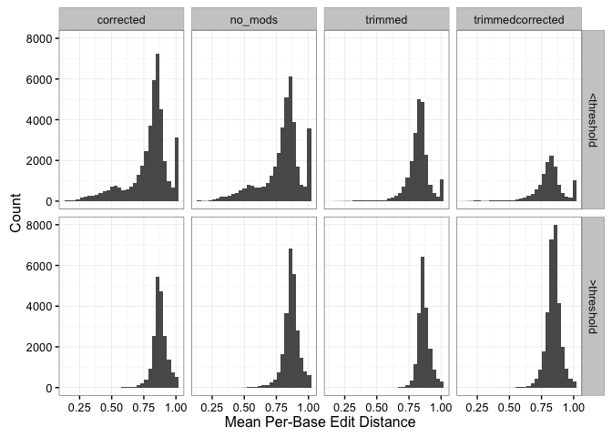

Trinity and Transrate Tutorial
================
Nate Olson & Leann Biancani
May 2, 2016

Background
----------

#### Transcriptomics

Transcriptomics is the study of the complete set of RNA transcripts in a given sample. Various aims of transcriptomic studies include cataloging all species of transcripts (mRNA, non-coding RNAs, smRNAs), determining gene structure, studying splicing patterns, identifying post-transcriptional modifications, or investigating changes in expression patterns (Wang, Gerstein, and Snyder 2009). Most RNA sequencing (RNA-seq) methods utilize short-read sequencing technologies to sequence a library of cDNA fragments generated from an isolation of RNA molecules. In order to characterize transcripts, these short reads sequences mush be assembled into contiguous sequences (contigs). In order to assemble a transcriptome, reads may either be aligned to a known reference genome or transcriptome sequence, or assembled *de novo*.

#### De novo Transcriptome assembly

*De novo* transcriptome assembly algorithms build contigs from RNA-seq data without the use of a reference genome. These assemblies, however, can be highly variable. There are many different algorithms available and a variety of parameters that can be specified for each method, resulting in the ability to generate multiple assemblies from a single set of reads (Smith-Unna et al. 2015). As such, it is necessary to be able to evaluate the quality and accuracy of a transcriptome assembly.

-   Variation in assemblies - same read data can generate very different assemblies (Smith-Unna et al. 2015)
    -   within assembly method: many parameters & heuristics (to accommodate variation in library construction, coverage depth, organisms)
    -   between assembly methods: many different approaches to assembly problem
        - Oases (Schulz et al. 2012 - not in bib yet)
        - SOAPdenovo-Trans (Xie et al. 2014 - not in bib yet)
        - Trinity (M. G. Grabherr et al. 2011, Haas et al. (2013))

#### Transcriptome assembly evaluation

      Two basic methods exist for evaluating transcriptomes. Reference based methods compare the assembly to known genome or transcriptome sequences, while read based methods map the RNA-seq reads back to the assembly.

-   Reference based
-   Read based
-   Transrate - contig level quality score (Smith-Unna et al. 2015)

#### C. elegans transcriptome assembly and evaluation (what we did)

Assembly
--------

### Source data

Sequence data identified by searching SRA for *C. elegans* and limiting results to RNA, identified a study for an Illumina HiSeq 2000, 94 bp paired end run. Accession SRR2969230 was used to generate and evaluate the assembly.

> Caenorhabditis elegans Transcriptome or Gene expression BioProject Abstract: Insulin/IGF-1 signaling (IIS) is a critical regulator of the most important biological decisions, from rates of growth, development, and metabolism, to reproduction and longevity. However, the neuron-specific IIS/FOXO targets that regulate these functions are still unknown. By isolating C. elegans neurons for transcriptional profiling, we identified both the wild-type and IIS/FOXO neuronal transcriptomes. Here we deposit the sequences for wt adult neurons and IIS mutants, as well as for isolated adult mechanosensory neurons.

Relevant *C. elegans* Reference Sequences

-   Transcriptome: <ftp://ftp.ensemblgenomes.org/pub/release-31/metazoa/gtf/caenorhabditis_elegans/Caenorhabditis_elegans.WBcel235.31.gtf.gz>
-   Genome: <ftp://ftp.ensemblgenomes.org/pub/release-31/metazoa/fasta/caenorhabditis_elegans/dna/Caenorhabditis_elegans.WBcel235.31.dna.chromosome.*.fa.gz>
-   Proteome: <ftp://ftp.ensemblgenomes.org/pub/release-31/metazoa/fasta/caenorhabditis_elegans/pep/Caenorhabditis_elegans.WBcel235.31.pep.all.fa.gz>

### How to run trinity

-   Link to website
-   Parameter description
-   Command used to generate *C. elegans* assembly

### Assembly results

Assembly metrics calculated using Transrate, see <http://hibberdlab.com/transrate/metrics.html> for a description of the different metrics.
**Metrics** \* n\_seq - number of contigs in the assembly
\* smallest - size of the shortest contig (bp)
\* largest - size of the longest contig (bp)
\* n50 - largest contig size at which at least 50% of bases are contained in contigs at least this length. \* n\_with\_orf - number of contigs with a open reading frame

``` r
assembly_metrics_df <- list(no_mods = "data/no_mods/", 
                            corrected = "data/corrected/",
                            trimmed = "data/trimmed/", 
                            trimmedcorrected = "data/trimmedcorrected/") %>% 
      map(paste0, "assemblies.csv") %>%  
      map_df(read_csv, .id = "read_set") %>% 
      select(-assembly) %>% 
      gather("metric","value", -read_set) %>% 
      mutate(read_set = factor(read_set, levels = c("no_mods","corrected","trimmed","trimmedcorrected")))
```

``` r
assembly_metrics_df %>% 
      filter(metric %in% c("n_seqs", "smallest", "largest", 
                           "n50", "n_with_orf")) %>%
      spread(metric, value) %>% 
      select(read_set, n_seqs, smallest, n50, largest, n_with_orf) %>% 
      kable(digits = 2,
            caption = "Trinity _C. elegans_ transcriptome assembly summary metrics.")
```

| read\_set        |  n\_seqs|  smallest|  n50|  largest|  n\_with\_orf|
|:-----------------|--------:|---------:|----:|--------:|-------------:|
| no\_mods         |    63353|       224|  465|     5446|         12426|
| corrected        |    61059|       224|  467|     4364|         12075|
| trimmed          |    42438|       224|  531|     7533|         10552|
| trimmedcorrected |    42851|       224|  532|     6816|         10645|

Assembly evaluation
-------------------

### Running transrate

-   Installation
    -   Precompiled binaries available from website (<http://hibberdlab.com/transrate/>), along with instructions to build from source
    -   also command to install dependencies `transrate --install-deps type` where type can be either `all`, `read`, or `ref`.
    -   See Transrate website for additional information for install.

**Command Line**
Correcting transcript IDs

*Read Based*

    transrate \
      --left=SRR2969230_1.fastq \
      --right=SRR2969230_2.fastq \
      --assembly=Trinity_sequences.Trinity.fixed.fasta \
      --output=transrate/

*Reference Based*

    transrate \
      --reference=Caenorhabditis_elegans.WBcel235.31.pep.all.fa \
      --assembly=Trinity_sequences.Trinity.fixed.fasta \
      --output=transrate/

### Transrate results

The unmodified read set was passed as input to Transrate, potentally biasing some metric results towards the unmodifed assembly.

#### run time

**TODO** Add runtime for other assemblies and reference based evaluations

-   real 890m58.016s
-   user 6665m50.869s
-   sys 11m5.890s

#### Assembly Scores

Read trimming and error correction resulted in the highest weighted assembly score, while having the lowest contig score cutoff, but a lower optimal score.

Weighted assembly score - takes into consideration expression level, generous to assemblies with high proportions of low expressed poorly assembled contigs.

``` r
assembly_metrics_df %>% 
      filter(metric %in% c("score", "optimal_score", "cutoff", "weighted")) %>%
      spread(metric, value) %>% 
      kable(digits = 2,
            caption = "Trinity _C. elegans_ transcriptome Transrate score summary.")
```

| read\_set        |  cutoff|  optimal\_score|  score|  weighted|
|:-----------------|-------:|---------------:|------:|---------:|
| no\_mods         |    0.19|            0.07|   0.02|      0.54|
| corrected        |    0.24|            0.07|   0.02|      0.65|
| trimmed          |    0.22|            0.07|   0.03|      0.67|
| trimmedcorrected |    0.07|            0.06|   0.03|      0.78|

#### Assembly Score Optimization

``` r
assembly_score_opt <- results_list %>% map(paste0,"assembly_score_optimisation.csv") %>% 
      map_df(read_csv, .id = "read_set") %>% 
      mutate(read_set = factor(read_set, levels = c("no_mods","corrected","trimmed","trimmedcorrected")))
```

Relationship between the cutoff for contig score and assembly score.

``` r
assembly_score_opt %>% 
      ggplot() + geom_path(aes(x = cutoff, y = assembly_score, color = read_set)) +
            theme_bw() +
            labs(x = "Contig Score Threshold", y = "Assembly Score")
```

    ## Warning: Removed 2 rows containing missing values (geom_path).

<!-- -->

### Contigs

see contigs.rb and read\_metrics.rb for additional information about metrics def score return (<span class="citeproc-not-found" data-reference-id="score">**???**</span>) if (<span class="citeproc-not-found" data-reference-id="score">**???**</span>) != -1 prod = \[p\_bases\_covered, 0.01\].max.to\_f \* \# proportion of bases covered \[p\_not\_segmented, 0.01\].max.to\_f \* \# prob contig has 0 changepoints \[p\_good, 0.01\].max.to\_f \* \# proportion of reads that mapped good \[p\_seq\_true, 0.01\].max.to\_f \# scaled 1 - mean per-base edit distance (<span class="citeproc-not-found" data-reference-id="score">**???**</span>) = \[prod, 0.01\].max Contig Score &gt; There are four components to the contig score: 1. A measure of whether each base has been called correctly. This is estimated using the mean per-base edit distance, i.e. how many changes would have to be made to a read covering a base before the sequence of the read and the covered region of the contig agreed perfectly. 2. A measure of whether each base is truly part of the transcript. This is estimated by determining whether any reads provide agreeing coverage for a base. 3. The probability that the contig is derived from a single transcript (rather than pieces of two or more transcripts). This is measured as the probability that the read coverage is best modelled by a single Dirichlet distribution, rather than two or more distributions. 4. The probability that the contig is structurally complete and correct. This is estimated as the proportion of assigned read pairs that agree with the structure and composition of the contig, which in turn is calculated by classifying the read pair alignments.

``` r
contig_stat <- results_list %>% map(paste0,"contigs.csv") %>% 
      map_df(read_csv, .id = "read_set")

contig_cutoff <- assembly_metrics_df %>% filter(metric == "cutoff") %>% 
      select(-metric) %>% rename(cutoff = value)
contig_stat <- contig_stat %>% left_join(contig_cutoff) %>% 
      mutate(contig_filt = cutoff < score)
```

    ## Joining by: "read_set"

    ## Warning in left_join_impl(x, y, by$x, by$y): joining factor and character
    ## vector, coercing into character vector

**Contig Score Distribution** Trimming reads resulted in a higher proportion of contigs with scores greater than 0.25 then assemblies using unmodified reads or only error corrected reads.

``` r
contig_stat %>% 
      ggplot() + geom_density(aes(x = score, color = read_set, fill = read_set), 
                              alpha = 0.25) + theme_bw()
```

<!-- -->

Relationship between contig score and length.

``` r
contig_stat %>% 
      ggplot() + geom_hex(aes(x = length, y = score)) +
            geom_hline(aes(yintercept = cutoff), 
                       color = "grey60", linetype = 2) +
            theme_bw() +
            labs(x = "Contig Length (bp)", y = "Contig Score") +
            facet_wrap(~read_set)
```


<p class="caption">
2D histogram of contig score and legnth, with color indicating abundance. Grey dotted lines are the contig score cutoff for optimal assembly score.
</p>

Proportion of bases in reads map to the transcript that support the transcript contig.

``` r
contig_stat %>% 
      ggplot() + geom_histogram(aes(x = p_good)) +
            theme_bw() +
            labs(x = "Proportion of Bases Aggree with Transcript",
                 y = "Count") +
            facet_grid(contig_filt~read_set) +
            theme(legend.position = "bottom")
```

    ## `stat_bin()` using `bins = 30`. Pick better value with `binwidth`.


<p class="caption">
Histogram of the proportion of bases in agreement with contig and contig length.
</p>

Proportion of bases in the contig covered, at least one read aligned to the contig coverage that position.

``` r
contig_stat %>% 
      ggplot() + geom_histogram(aes(x = p_bases_covered)) +
            theme_bw() +
            labs(x = "Proportion of Covered Bases", 
                 y = "Count") +
            facet_grid(contig_filt~read_set) +
            theme(legend.position = "bottom")
```

    ## `stat_bin()` using `bins = 30`. Pick better value with `binwidth`.

<!-- -->

Mean per-base contig edit distance, average number of base pair differences between contig and reads.

``` r
contig_stat %>% 
      ggplot() + geom_histogram(aes(x = p_seq_true)) +
            theme_bw() +
            labs(x = "Mean Per-Base Edit Distance", 
                 y = "Count") +
            facet_grid(contig_filt~read_set) +
            theme(legend.position = "bottom")
```

    ## `stat_bin()` using `bins = 30`. Pick better value with `binwidth`.

<!-- -->

Probability that a contig is not a chimeric misassembly, where sequences from two different contigs are incorrectly assembled together.

``` r
contig_stat %>% 
      ggplot() + geom_histogram(aes(x = p_not_segmented)) +
            theme_bw() +
            labs(x = "Proportion of Non-Segmented Contigs", 
                 y = "Count") +
            facet_grid(contig_filt~read_set) +
            theme(legend.position = "bottom")
```

    ## `stat_bin()` using `bins = 30`. Pick better value with `binwidth`.

<!-- -->

The individual parameters used to calculate the contig score are weakly correlated. Correlation values are similar to thoes presented in the Transrate publication.

``` r
for(i in names(results_list)){
      pl <- contig_stat %>% filter(read_set == i) %>% 
            select(p_good, p_bases_covered, p_seq_true, p_not_segmented) %>% 
            ggcorr(method = c("pairwise","spearman"),label = TRUE) + 
                  ggtitle(i)
      print(pl)
}
```

<!-- --><!-- --><!-- --><!-- -->

#### Reference Based Results

**TODO** Describe CRB method

``` r
ref_contig <- results_list %>% map(paste0,"contigs.csv") %>% 
      map_df(read_csv, .id = "read_set")
```

\_\_TODO\_\_Summary table with assembly, p contigs with CRBB (proportion of contigs iwth CRB-Blast), p\_ref crbb proprotion ref with CRBB, ref coverage - proportion of reference bases covered by CRB hits, collapse factor - high chimeras, p covX - proportion protein coverage, Comprison of contigs with and with out CRB hits. Assemblies using untrimmed read set had a larger number of contigs, but little impact of the proportion of CRB hits.

``` r
ggplot(ref_contig) + geom_bar(aes(x = read_set)) + facet_wrap(~has_crb)
```

<!-- -->

Comprison of contig length and ORF length for contigs with and without CRB hits. Contigs with CRB hits were long and contined larger predicted ORFs.

``` r
ggplot(ref_contig) + geom_boxplot(aes(x = has_crb, y = length)) + facet_wrap(~read_set)
```

<!-- -->

``` r
ggplot(ref_contig) + geom_boxplot(aes(x = has_crb, y = orf_length)) + facet_wrap(~read_set)
```

<!-- -->

Exploring contigs with CRB hits.

``` r
crb_contig <- ref_contig %>% filter(has_crb == "true")
```

``` r
ggplot(crb_contig) + geom_hex(aes(x = length, y = reference_coverage)) + 
      facet_wrap(~read_set)
```

<!-- -->

``` r
ggplot(crb_contig) + geom_hex(aes(x = orf_length, y = reference_coverage)) +
      facet_wrap(~read_set)
```

<!-- -->

### Contig Score and Hit Coverage

``` r
contig_crb_score <- crb_contig %>% left_join(contig_stat)
```

    ## Joining by: c("read_set", "contig_name", "length", "prop_gc", "gc_skew", "at_skew", "cpg_count", "cpg_ratio", "orf_length", "linguistic_complexity_6")

**TODO** Better way to present relationship

``` r
ggplot(contig_crb_score) + 
      geom_hex(aes(x = reference_coverage, y = score)) +
      facet_wrap(~read_set)
```

<!-- -->

**TODO** Upper limit? correlation between reference coverage and score Looking at tpm

Conclusions
-----------

-   How did Trinity do?
-   How did transrate compare to other methods?
-   Recommendations for transcriptome assembly and evaluation

Session Information
-------------------

**Session Info**

``` r
s_info <- devtools::session_info()
print(s_info$platform)
```

    ##  setting  value                       
    ##  version  R version 3.2.3 (2015-12-10)
    ##  system   x86_64, darwin13.4.0        
    ##  ui       X11                         
    ##  language (EN)                        
    ##  collate  en_US.UTF-8                 
    ##  tz       America/New_York            
    ##  date     2016-05-15

``` r
kable(s_info$packages)
```

| package    | \*  | version | date       | source                               |
|:-----------|:----|:--------|:-----------|:-------------------------------------|
| assertthat |     | 0.1     | 2013-12-06 | CRAN (R 3.2.0)                       |
| colorspace |     | 1.2-6   | 2015-03-11 | CRAN (R 3.2.0)                       |
| DBI        |     | 0.3.1   | 2014-09-24 | CRAN (R 3.2.0)                       |
| devtools   |     | 1.9.1   | 2015-09-11 | CRAN (R 3.2.0)                       |
| digest     |     | 0.6.9   | 2016-01-08 | CRAN (R 3.2.3)                       |
| dplyr      | \*  | 0.4.3   | 2015-09-01 | CRAN (R 3.2.0)                       |
| evaluate   |     | 0.8     | 2015-09-18 | CRAN (R 3.2.0)                       |
| formatR    |     | 1.2.1   | 2015-09-18 | CRAN (R 3.2.0)                       |
| GGally     | \*  | 1.0.1   | 2016-01-14 | CRAN (R 3.2.3)                       |
| ggplot2    | \*  | 2.1.0   | 2016-03-01 | CRAN (R 3.2.4)                       |
| gtable     |     | 0.1.2   | 2012-12-05 | CRAN (R 3.2.0)                       |
| hexbin     | \*  | 1.27.1  | 2015-08-19 | CRAN (R 3.2.0)                       |
| highr      |     | 0.5.1   | 2015-09-18 | CRAN (R 3.2.0)                       |
| htmltools  |     | 0.3     | 2015-12-29 | CRAN (R 3.2.3)                       |
| knitr      | \*  | 1.12.3  | 2016-01-22 | CRAN (R 3.2.3)                       |
| labeling   |     | 0.3     | 2014-08-23 | CRAN (R 3.2.0)                       |
| lattice    |     | 0.20-33 | 2015-07-14 | CRAN (R 3.2.3)                       |
| lazyeval   |     | 0.1.10  | 2015-01-02 | CRAN (R 3.2.0)                       |
| magrittr   |     | 1.5     | 2014-11-22 | CRAN (R 3.2.0)                       |
| memoise    |     | 0.2.1   | 2014-04-22 | CRAN (R 3.2.0)                       |
| munsell    |     | 0.4.2   | 2013-07-11 | CRAN (R 3.2.0)                       |
| plyr       |     | 1.8.3   | 2015-06-12 | CRAN (R 3.2.0)                       |
| purrr      | \*  | 0.2.1   | 2016-02-13 | CRAN (R 3.2.3)                       |
| R6         |     | 2.1.1   | 2015-08-19 | CRAN (R 3.2.0)                       |
| Rcpp       |     | 0.12.2  | 2015-11-15 | CRAN (R 3.2.2)                       |
| readr      | \*  | 0.2.2   | 2015-10-22 | CRAN (R 3.2.0)                       |
| reshape    |     | 0.8.5   | 2014-04-23 | CRAN (R 3.2.0)                       |
| reshape2   |     | 1.4.1   | 2014-12-06 | CRAN (R 3.2.0)                       |
| rmarkdown  |     | 0.9.5   | 2016-01-25 | Github (<rstudio/rmarkdown@e7a1e6b>) |
| scales     |     | 0.3.0   | 2015-08-25 | CRAN (R 3.2.0)                       |
| stringi    |     | 1.0-1   | 2015-10-22 | CRAN (R 3.2.0)                       |
| stringr    | \*  | 1.0.0   | 2015-04-30 | CRAN (R 3.2.0)                       |
| tidyr      | \*  | 0.4.1   | 2016-02-05 | CRAN (R 3.2.3)                       |
| yaml       |     | 2.1.13  | 2014-06-12 | CRAN (R 3.2.0)                       |

References
----------

Grabherr, Manfred G, Brian J Haas, Moran Yassour, Joshua Z Levin, Dawn A Thompson, Ido Amit, Xian Adiconis, et al. 2011. “Full-length transcriptome assembly from RNA-Seq data without a reference genome.” *Nature Biotechnology* 29 (7): 644–52.

Haas, Brian J, Alexie Papanicolaou, Moran Yassour, Manfred Grabherr, Philip D Blood, Joshua Bowden, Matthew Brian Couger, et al. 2013. “De Novo Transcript Sequence Reconstruction from RNA-Seq Using the Trinity Platform for Reference Generation and Analysis.” *Nature Protocols* 8 (8). Nature Publishing Group: 1494–1512.

Smith-Unna, Richard D, Chris Boursnell, Rob Patro, Julian M Hibberd, and Steven Kelly. 2015. “TransRate: Reference Free Quality Assessment of de-Novo Transcriptome Assemblies.” *BioRxiv*. Cold Spring Harbor Labs Journals, 021626.

Wang, Zhong, Mark Gerstein, and Michael Snyder. 2009. “RNA-Seq: a revolutionary tool for transcriptomics.” *Nature Reviews. Genetics* 10 (1): 57–63.
