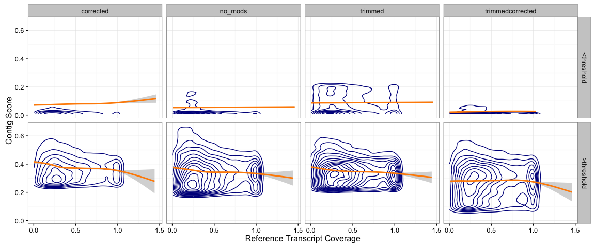

Transcriptome Assembly and Evaluation
================
Nate Olson & Leann Biancani
May 15, 2016

Background
----------

#### Transcriptomics

Transcriptomics is the study of the complete set of RNA transcripts in a given sample. Various aims of transcriptomic studies include cataloging all species of transcripts (mRNA, non-coding RNAs, smRNAs), determining gene structure, studying splicing patterns, identifying post-transcriptional modifications, or investigating changes in expression patterns (Wang, Gerstein, and Snyder 2009). Most RNA sequencing (RNA-seq) methods utilize short-read sequencing technologies to sequence a library of cDNA fragments generated from an isolation of RNA molecules. In order to characterize transcripts, these short reads sequences must be assembled into contiguous sequences (contigs). To assemble a transcriptome, reads may either be aligned to a known reference genome or transcriptome sequence, or assembled *de novo*.

#### De novo Transcriptome assembly

*De novo* transcriptome assembly algorithms build contigs from RNA-seq data without the use of a reference genome. These assemblies, however, can be highly variable. There are many different algorithms available and a variety of parameters that can be specified for each method, resulting in the ability to generate multiple assemblies from a single set of reads (Smith-Unna et al. 2015). As such, it is necessary to be able to evaluate the quality and accuracy of a transcriptome assembly.

Trinity (M. G. Grabherr et al. 2011, Haas et al. (2013))

#### Transcriptome assembly evaluation

Two basic methods exist for evaluating transcriptomes. Reference based methods compare the assembly to known genome or transcriptome sequences, while read based methods map the RNA-seq reads back to the assembly.

Transcriptome Assembly and Evaluation
-------------------------------------

#### Source data

A set of raw RNA-seq reads for *C. elegans* was identified and downloaded from the SRA database.

Shell command:

``` bash
Fastq-dump -I --split-files SRR2969230
```

Dataset Information:

-   Accession number: SRR2969230
-   Description:

> Total RNA from tissue disrupted “whole worm” samples was isolated and amplified using the NuGen Ovation RNAseq v2 kit. Amplified cDNA was sheared to 200bp fragments. Library was prepared using the Illumina TruSeq DNA Sample Prep kit.

-   Study:

> Caenorhabditis elegans Transcriptome or Gene expression BioProject Abstract: Insulin/IGF-1 signaling (IIS) is a critical regulator of the most important biological decisions, from rates of growth, development, and metabolism, to reproduction and longevity. However, the neuron-specific IIS/FOXO targets that regulate these functions are still unknown. By isolating C. elegans neurons for transcriptional profiling, we identified both the wild-type and IIS/FOXO neuronal transcriptomes. Here we deposit the sequences for wt adult neurons and IIS mutants, as well as for isolated adult mechanosensory neurons.

#### Relevant *C. elegans* Reference Sequences

-   Transcriptome: <ftp://ftp.ensemblgenomes.org/pub/release-31/metazoa/gtf/caenorhabditis_elegans/Caenorhabditis_elegans.WBcel235.31.gtf.gz>
-   Genome: <ftp://ftp.ensemblgenomes.org/pub/release-31/metazoa/fasta/caenorhabditis_elegans/dna/Caenorhabditis_elegans.WBcel235.31.dna.chromosome.*.fa.gz>
-   Proteome: <ftp://ftp.ensemblgenomes.org/pub/release-31/metazoa/fasta/caenorhabditis_elegans/pep/Caenorhabditis_elegans.WBcel235.31.pep.all.fa.gz>

#### Read Trimming

#### Error Correction

#### Assembly

### How to run trinity

-   Link to website
-   Parameter description
-   Command used to generate *C. elegans* assembly

### Assembly results

Assembly metrics calculated using Transrate, see <http://hibberdlab.com/transrate/metrics.html> for a description of the different metrics.

| Dataset          |  \# of Contigs|  Shortest Contig (bp)|  Longest Contig (bp)|  N50 (bp)|  \# Contigs with ORF|
|:-----------------|--------------:|---------------------:|--------------------:|---------:|--------------------:|
| no\_mods         |          63353|                   224|                 5446|       465|                12426|
| corrected        |          61059|                   224|                 4364|       467|                12075|
| trimmed          |          42438|                   224|                 7533|       531|                10552|
| trimmedcorrected |          42851|                   224|                 6816|       532|                10645|

N50 is the length (bp) of contig where &gt; 50% of assembled bases are in contigs at least as long

Assembly evaluation
-------------------

### Running TransRate

#### Installation

-   Precompiled binaries available from website (<http://hibberdlab.com/transrate/>), along with instructions to build from source.
-   Command to install dependencies `transrate --install-deps type` where type can be either `all`, `read`, or `ref`.
-   See Transrate website for additional information for install.

#### Read Based Evaluation

For the read based evaluation Transrate maps the raw read data to the transcriptome assembly then uses a set of four metrics to calculate, contig and assembly quality scores.

**Contig Score:** the product of the following metrics.

1.  Edit distance - characterization of contig base accuracy, calculated from read-contig edit distance.
2.  Coverage - characterization of based being part of a transcript, calculated from contig based read coverage.
3.  Chimera - probability contig is derived from a single transcript, calculated based on whether the contigs fits a single or double Dirichlet distribution.
4.  Complete - probability contig is complete and correct, calculated using read pair alignments.

**Assembly Score** is calculated from the mean contig score and proprotion of read pairs mapping to the assembly.

**Command Line**

    transrate \
      --left=SRR2969230_1.fastq \
      --right=SRR2969230_2.fastq \
      --assembly=Trinity_sequences.Trinity.fixed.fasta \
      --output=transrate/

#### Reference Base Evaluation

Transrate uses a reciprical blast approach for reference based assembly evaluation. A sequence is classified as the reference for a contig if the reference sequence and contig are the top BLAST hits when comparing the reference sequence against all contigs and comparing the contig againts all reference sequences. The reciprical BLAST method is described in Aubry et al. (2014).

**Command Line**

    transrate \
      --reference=Caenorhabditis_elegans.WBcel235.31.pep.all.fa \
      --assembly=Trinity_sequences.Trinity.fixed.fasta \
      --output=transrate/

### Transrate results

The unmodified read set was passed as input to Transrate, potentally biasing some metric results towards the unmodifed assembly.

#### Read Based Results

##### Contigs

**Contig Score Distribution** Trimming reads resulted in a higher proportion of contigs with scores greater than 0.25 then assemblies using unmodified reads or only error corrected reads.


##### Assembly Score

Relationship between the cutoff for contig score and assembly score. 

###### Assembly Score Summary

Read trimming and error correction resulted in the highest weighted assembly score, while having the lowest contig score cutoff, but a lower optimal score.

Weighted assembly score - takes into consideration expression level, can bias assemblies with high proportions of low expressed poorly assembled contigs.

| Dataset          |  Assembly Score|  Optimized Score|  Contig Score Threshold|  Weighted Score|
|:-----------------|---------------:|----------------:|-----------------------:|---------------:|
| no\_mods         |           0.022|            0.068|                   0.188|           0.538|
| corrected        |           0.022|            0.069|                   0.243|           0.652|
| trimmed          |           0.031|            0.067|                   0.218|           0.667|
| trimmedcorrected |           0.032|            0.063|                   0.073|           0.778|

##### Contig Score Breakdown

The following figures show the relationship between individual contig metric distributions and the optimized assembly contig score threshold. For all four metrics the metric distribution shifts to the right (increases) for contigs with scores above the optimized assembly contig score threashold.

###### Edit distance

Mean per-base contig edit distance, average number of base pair differences between contig and reads.


###### Coverage

Proportion of bases in the contig covered, at least one read aligned to the contig coverage that position.


###### Chimera

Probability that a contig is not a chimeric misassembly, where sequences from two different contigs are incorrectly assembled together.


###### Complete

Proportion of bases in reads map to the transcript that support the transcript contig. 

#### Reference Based Evaluation

Contigs were evaluated based on the reference coverage for contigs with CRB hits, using the *C. elegans* proteome as the reference. Reference coverage was calculated as the proportion of the reference transcript covered by the contig.

Relationship between reference coverage and contig length. 

Relationship between reference coverage and contig ORF length. 

#### Read and Reference Evaluation Comparison

No clear relationship between contig score and reference coverage.


Conclusions
-----------

-   Read trimming has a greater impact on assembly size and number of contigs than error correction.
-   Read based assembly evaluation - potentially biased by the use of un-modified reads
-   No clear relationship between contig score and reference coverage

Session Information
-------------------

**Session Info**

    ##  setting  value                       
    ##  version  R version 3.2.4 (2016-03-10)
    ##  system   x86_64, darwin13.4.0        
    ##  ui       X11                         
    ##  language (EN)                        
    ##  collate  en_US.UTF-8                 
    ##  tz       America/New_York            
    ##  date     2016-05-15

| package    | \*  | version    | date       | source                            |
|:-----------|:----|:-----------|:-----------|:----------------------------------|
| assertthat |     | 0.1        | 2013-12-06 | CRAN (R 3.2.0)                    |
| colorspace |     | 1.2-6      | 2015-03-11 | CRAN (R 3.2.0)                    |
| DBI        |     | 0.4-1      | 2016-05-08 | CRAN (R 3.2.5)                    |
| devtools   |     | 1.11.1     | 2016-04-21 | CRAN (R 3.2.5)                    |
| digest     |     | 0.6.9      | 2016-01-08 | CRAN (R 3.2.3)                    |
| dplyr      | \*  | 0.4.3.9000 | 2016-02-11 | Github (<hadley/dplyr@9bae2aa>)   |
| evaluate   |     | 0.9        | 2016-04-29 | CRAN (R 3.2.5)                    |
| formatR    |     | 1.4        | 2016-05-09 | CRAN (R 3.2.4)                    |
| GGally     | \*  | 1.0.1      | 2016-01-14 | CRAN (R 3.2.3)                    |
| ggplot2    | \*  | 2.1.0      | 2016-03-01 | CRAN (R 3.2.4)                    |
| gtable     |     | 0.2.0      | 2016-02-26 | CRAN (R 3.2.3)                    |
| hexbin     | \*  | 1.27.1     | 2015-08-19 | CRAN (R 3.2.0)                    |
| highr      |     | 0.6        | 2016-05-09 | CRAN (R 3.2.4)                    |
| htmltools  |     | 0.3.5      | 2016-03-21 | CRAN (R 3.2.4)                    |
| knitr      | \*  | 1.13       | 2016-05-09 | CRAN (R 3.2.4)                    |
| labeling   |     | 0.3        | 2014-08-23 | CRAN (R 3.2.0)                    |
| lattice    |     | 0.20-33    | 2015-07-14 | CRAN (R 3.2.4)                    |
| lazyeval   |     | 0.1.10     | 2015-01-02 | CRAN (R 3.2.0)                    |
| magrittr   |     | 1.5        | 2014-11-22 | CRAN (R 3.2.0)                    |
| MASS       |     | 7.3-45     | 2015-11-10 | CRAN (R 3.2.2)                    |
| Matrix     |     | 1.2-6      | 2016-05-02 | CRAN (R 3.2.5)                    |
| memoise    |     | 1.0.0      | 2016-01-29 | CRAN (R 3.2.3)                    |
| mgcv       |     | 1.8-12     | 2016-03-03 | CRAN (R 3.2.4)                    |
| munsell    |     | 0.4.3      | 2016-02-13 | CRAN (R 3.2.3)                    |
| nlme       |     | 3.1-128    | 2016-05-10 | CRAN (R 3.2.5)                    |
| plyr       |     | 1.8.3      | 2015-06-12 | CRAN (R 3.2.0)                    |
| purrr      | \*  | 0.2.1      | 2016-02-13 | CRAN (R 3.2.3)                    |
| R6         |     | 2.1.2      | 2016-01-26 | CRAN (R 3.2.3)                    |
| Rcpp       |     | 0.12.4     | 2016-03-26 | CRAN (R 3.2.4)                    |
| readr      | \*  | 0.2.2      | 2015-10-22 | CRAN (R 3.2.0)                    |
| reshape    |     | 0.8.5      | 2014-04-23 | CRAN (R 3.2.0)                    |
| reshape2   |     | 1.4.1      | 2014-12-06 | CRAN (R 3.2.0)                    |
| rmarkdown  |     | 0.9.6      | 2016-05-01 | CRAN (R 3.2.5)                    |
| scales     |     | 0.4.0      | 2016-02-26 | CRAN (R 3.2.3)                    |
| stringi    |     | 1.0-1      | 2015-10-22 | CRAN (R 3.2.1)                    |
| stringr    | \*  | 1.0.0.9000 | 2015-11-23 | Github (<hadley/stringr@a67f8f0>) |
| tidyr      | \*  | 0.4.1      | 2016-02-05 | CRAN (R 3.2.3)                    |
| withr      |     | 1.0.1      | 2016-02-04 | CRAN (R 3.2.3)                    |
| yaml       |     | 2.1.13     | 2014-06-12 | CRAN (R 3.2.0)                    |

References
----------

Aubry, Sylvain, Steven Kelly, Britta MC Kümpers, Richard D Smith-Unna, and Julian M Hibberd. 2014. “Deep Evolutionary Comparison of Gene Expression Identifies Parallel Recruitment of Trans-Factors in Two Independent Origins of c 4 Photosynthesis.” *PLoS Genet* 10 (6). Public Library of Science: e1004365.

Grabherr, Manfred G, Brian J Haas, Moran Yassour, Joshua Z Levin, Dawn A Thompson, Ido Amit, Xian Adiconis, et al. 2011. “Full-length transcriptome assembly from RNA-Seq data without a reference genome.” *Nature Biotechnology* 29 (7): 644–52.

Haas, Brian J, Alexie Papanicolaou, Moran Yassour, Manfred Grabherr, Philip D Blood, Joshua Bowden, Matthew Brian Couger, et al. 2013. “De Novo Transcript Sequence Reconstruction from RNA-Seq Using the Trinity Platform for Reference Generation and Analysis.” *Nature Protocols* 8 (8). Nature Publishing Group: 1494–1512.

Smith-Unna, Richard D, Chris Boursnell, Rob Patro, Julian M Hibberd, and Steven Kelly. 2015. “TransRate: Reference Free Quality Assessment of de-Novo Transcriptome Assemblies.” *BioRxiv*. Cold Spring Harbor Labs Journals, 021626.

Wang, Zhong, Mark Gerstein, and Michael Snyder. 2009. “RNA-Seq: a revolutionary tool for transcriptomics.” *Nature Reviews. Genetics* 10 (1): 57–63.
